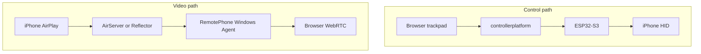

# Architecture

## TWO INDEPENDENT PATHS (permanent)

Control and video are separate forever. The ESP32 never carries video. The video agent never owns HID.

```
CONTROL                          VIDEO
=======                          =====
Browser ──WSS──▶ Hub             iPhone ──AirPlay──▶ sidecar or AirServer
                   │                                      │
                   ▼                                      ▼
                ESP32-S3                           RemotePhone Agent
                   │                                      │
                   ▼                                      ▼
              iPhone (HID)                         Browser (WebRTC)
```



---

## Module layout

```
RemotePhone.Agent.Core/          # net10.0 — unit-tested logic
  Models/                        # CaptureState(+Machine), Orientation, ReceiverWindowInfo, stats
  AirPlay/                       # AirPlayReceiverDetector scoring/filter
  Configuration/                 # AgentOptions
  Capture/                       # BoundedFrameQueue
  Signaling/                     # Messages, serializer, SessionGate
  WebRtc/                        # IWebRtcStreamingService, ISignalingClient
  Calibration/                   # PointerCalibration, LetterboxMapper, HomingPlan
  Reliability/                   # ExponentialBackoff, SoakMetrics, FailureModeCatalog

RemotePhone.Agent/               # WinUI 3 + Windows App SDK 2.3.1
  AirPlay/                       # NativeMethods, WindowEnumerator (HWND enum)
  Capture/                       # Graphics.Capture session, preview renderer
  UI / MainPage                  # Receiver list, select, preview, diagnostics
  Configuration / logging        # appsettings binding, ILogger
```

**Rule of thumb:** Pure logic lives in **Core**. Win32 / WinRT / WinUI live in **Agent**.

---

## Phase map

| Phase | Deliverable | Crosses into |
|-------|-------------|--------------|
| 1 | Detect receiver HWND + local GPU preview | Agent UI + Core detector/state |
| 2 | WebRTC encode + signaling + test HTML | SIPSorcery, PROTOCOL.md |
| 3 | Platform hub + controller.html video region | `controllerplatform` only (not ESP firmware) |
| 4 | Normalized taps + calibration / homing | Control path still via hub→ESP HID |
| 5 | Failure matrix, soak, backoff | Reliability modules |

Phase 1 **must** prove local preview before Phase 2 streaming.

---

## Data flow (video, Phase 2+)

    1. Agent downloads/launches AirPlay-Windows sidecar (or user picks AirServer HWND).
    2. Operator selects HWND → Graphics Capture frame pool → bounded queue (drop oldest).
3. Preview presents latest GPU frame locally.
4. Streaming service wraps frames as WebRTC video track; signaling exchanges offer/answer/ICE.
5. `SessionGate` accepts only the active `sessionId`; stale SDP/ICE dropped.
6. `VideoMetadata` / `StreamState` / `SourceLost` keep the browser aligned with capture reality.

Control taps (Phase 4) map letterboxed clicks → normalized coords → calibrated relative HID sequences **through the control path**, not through the video media track.
